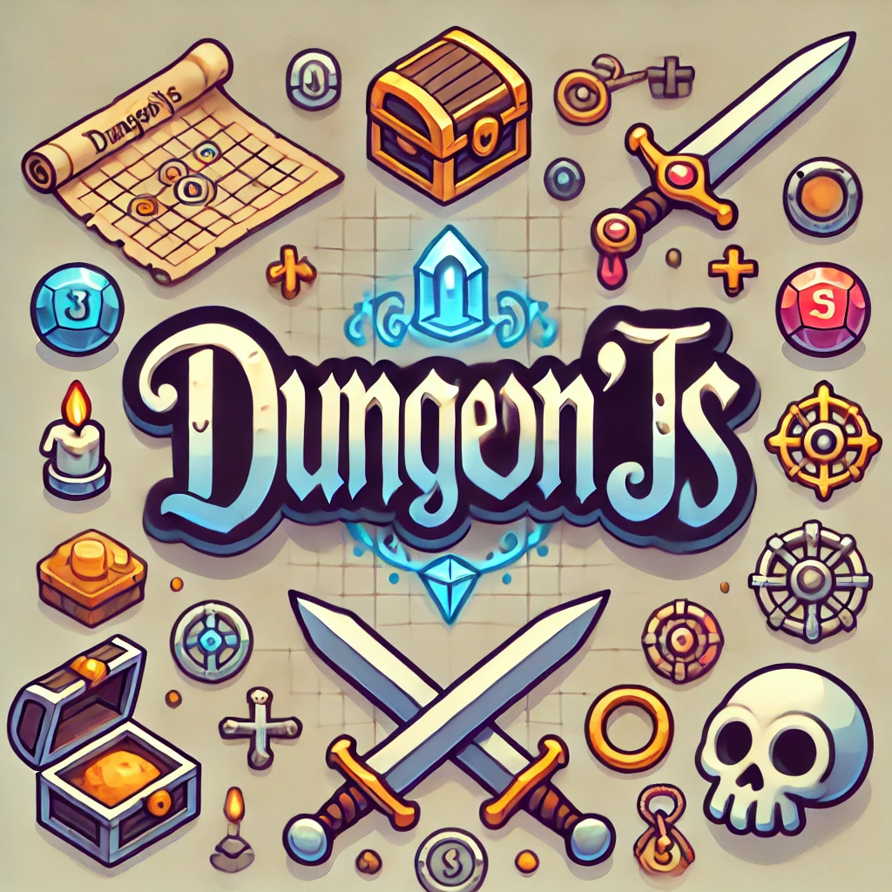

<!-- PROJECT SHIELDS -->
[![Contributors][contributors-shield]][contributors-url]
[![Forks][forks-shield]][forks-url]
[![Stargazers][stars-shield]][stars-url]
[![Issues][issues-shield]][issues-url]
[![License][license-shield]][license-url]
[![LinkedIn][linkedin-shield]][linkedin-url]

<div align="center">
  <a href="https://github.com/Zusoy/dungeonjs">
    
  </a>
  <br />
  <p align="center">
    An open-source multiplayer browser game !
    <br />
    <br />
    <a href="https://github.com/Zusoy/dungeonjs/issues">Report Bug</a>
    ·
    <a href="https://github.com/Zusoy/dungeonjs/pulls">Request Feature</a>
  </p>
</div>

<!-- TABLE OF CONTENTS -->
<details>
  <summary>Table of Contents</summary>
  <ol>
    <li>
      <a href="#about-the-project">About The Project</a>
      <ul>
        <li><a href="#features">Features</a></li>
        <li><a href="#built-with">Built With</a></li>
      </ul>
    </li>
    <li>
      <a href="#getting-started">Getting Started</a>
      <ul>
        <li><a href="#prerequisites">Prerequisites</a></li>
        <li><a href="#installation">Installation</a></li>
        <li><a href="#access">Access</a></li>
      </ul>
    </li>
    <li><a href="#contact">Contact</a></li>
  </ol>
</details>

<!-- ABOUT THE PROJECT -->
## About The Project

Dungeon'JS is a browser-based 3D multiplayer game.
Built with Three.js and React Three Fiber, the game offers a strategic and engaging dungeon-crawling experience with friends.

## Features

* Turn-Based Dungeon Exploration: Discover new rooms and strategically plan your movements to maximize your rewards.
* Room Generation: When moving into an undiscovered room, a new dungeon room is generated, possibly hiding treasures, keys, or enemies.
* Dice-Based Combat: Battle enemies by rolling a dice—roll higher than their health points (HP) to defeat them and loot new weapons.
* Treasure Collection: Open locked chests using collected keys to obtain treasures.
* Winning Objective: The game ends when a player defeats the dungeon's most powerful enemy. The player with the most collected treasures wins the game.

## Built with
The project is built with [three-js](https://threejs.org/) and React using [react-fiber](https://r3f.docs.pmnd.rs/) wrapper.
For the multiplayer part, [socket.io](https://socket.io/) is used.


## Getting Started

This is a quick start to install the application locally

## Prerequisites

You need docker on your machine to get Dungeon'JS working.

* `docker >=20.10.14` is required

## How to install

To install the project on your local machine, you'll need docker installed.
Then follow those steps

* clone the repository

```bash
git clone git@github.com:Zusoy/dungeonjs.git
```

* copy the required `.env` file

```bash
cp -n .env.dist .env
```

* build the stack

```bash
make build
```

* start the project

```bash
make start
```

## Access

| URL                       | Link     |
|---------------------------|----------|
| http://127.0.0.1:3000     | Client   |
| http://127.0.0.1:8080     | Socket   |

## Contact

Project Link: [https://github.com/Zusoy/dungeonjs](https://github.com/Zusoy/dungeonjs)

<!-- MARKDOWN LINKS & IMAGES -->
<!-- https://www.markdownguide.org/basic-syntax/#reference-style-links -->
[contributors-shield]: https://img.shields.io/github/contributors/zusoy/dungeonjs.svg?style=for-the-badge
[contributors-url]: https://github.com/Zusoy/dungeonjs/graphs/contributors
[forks-shield]: https://img.shields.io/github/forks/zusoy/dungeonjs.svg?style=for-the-badge
[forks-url]: https://github.com/Zusoy/dungeonjs/network/members
[stars-shield]: https://img.shields.io/github/stars/zusoy/dungeonjs.svg?style=for-the-badge
[stars-url]: https://github.com/Zusoy/dungeonjs/stargazers
[issues-shield]: https://img.shields.io/github/issues/zusoy/dungeonjs.svg?style=for-the-badge
[issues-url]: https://github.com/Zusoy/dungeonjs/issues
[linkedin-shield]: https://img.shields.io/badge/-LinkedIn-black.svg?style=for-the-badge&logo=linkedin&colorB=555
[linkedin-url]: https://www.linkedin.com/in/gr%C3%A9goire-drapeau-742425123/
[license-shield]: https://img.shields.io/github/license/zusoy/dungeonjs.svg?style=for-the-badge
[license-url]: https://github.com/zusoy/dungeonjs/blob/master/LICENSE.txt