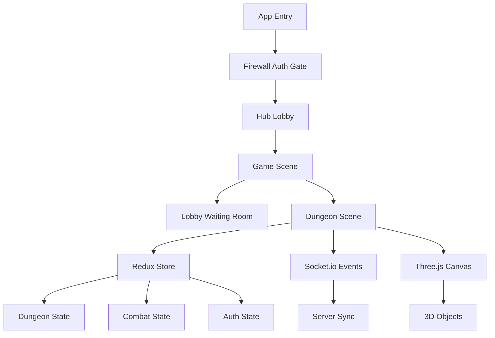

# DungeonJS Client

> A 3D multiplayer turn-based dungeon crawler built with React Three Fiber


## Overview

The client is a real-time multiplayer 3D dungeon crawler where players explore procedurally generated dungeons, engage in dice-based combat, and collect treasures. Built with React Three Fiber for stunning 3D graphics and Socket.io for seamless real-time synchronization across all players.

## Tech Stack

| Category | Technologies |
|----------|-------------|
| **Core** | React 18.3, TypeScript 5.6, Vite 6.0 |
| **3D Rendering** | Three.js 0.172, React Three Fiber 8.17, React Three Drei, GLTF Models |
| **State Management** | Redux Toolkit 2.5, Redux-Saga 1.3 |
| **UI & Styling** | Tailwind CSS 3.3, DaisyUI 4.12, Framer Motion 12.12 |
| **Real-time** | Socket.io Client 4.8 |

## Features

- **Multiplayer Turn-Based Gameplay** - Multiple players take turns exploring the dungeon
- **3D Game World** - Isometric view with free camera control
- **4 Hero Classes** - Knight, Rogue, Mage, Barbarian (all with animated 3D models)
- **Dice-Based Combat** - Roll 2d6 + weapon bonus vs enemy defense
- **Procedural Generation** - Rooms and corridors generated as you explore
- **Inventory System** - Collect treasures, weapons (sword, axe, dagger), and keys
- **Multiple Enemy Types** - Mage, Minion, Rogue, Warrior, and the Golem boss
- **Win Condition** - Defeat the Golem boss, player with most treasures wins

## Architecture

The client follows **Domain-Driven Design** with feature-based organization:



Each feature follows a layered structure:
- **application/** - Redux slices (state + reducers)
- **infrastructure/** - Redux-Saga effects (side effects + Socket.io channels)
- **presentation/** - React components (UI + 3D objects)
- **domain/** - Business logic and types

## Getting Started

### Prerequisites

- Node.js 18+
- pnpm (recommended) or npm

### Installation

```bash
# Install dependencies
pnpm install

# Copy environment file (if needed)
cp .env.dist .env
```

### Development

```bash
# Start development server (runs on port 3000)
pnpm run dev

# Build for production
pnpm run build

# Run linter
pnpm run lint
```

For Docker-based development, see the main [CLAUDE.md](../../CLAUDE.md#development-commands).

## Project Structure

```
src/
├── base/                      # Core app shells (App, Hub, Game)
├── app/                       # Redux store configuration
├── features/                  # Feature modules (DDD approach)
│   ├── Authentication/        # Login & connection
│   ├── Rooms/                 # Room creation/joining
│   ├── Lobby/                 # Pre-game lobby
│   └── Game/
│       ├── Dungeon/          # Main game world
│       └── Combat/           # Combat mechanics
├── services/                  # Socket.io client
├── types/                     # Shared domain types
├── widgets/                   # Reusable UI components
└── main.tsx                   # Entry point
```

## State Management

The app uses **Redux Toolkit** with **Redux-Saga** for side effects:

- **Redux Slices**: `auth`, `rooms`, `lobby`, `dungeon`, `combat`
- **Event Channels**: Map Socket.io events to Redux actions
- **Sagas**: Handle async operations and Socket.io communication

State updates flow: `User Action → Redux → Saga → Socket.io → Server → Socket.io Event → Channel → Redux`

## 3D Rendering

Built with **React Three Fiber**, a React renderer for Three.js:

- **Canvas**: Main 3D scene with dark background and city lighting
- **GLTF Models**: Animated character models with 80+ animations
- **Game Objects**: Modular components for tiles, characters, props, and loots
- **Camera Controls**: Orbital camera with smooth focus transitions
- **Animation System**: Skeletal animations via `useAnimations()` hook

Key 3D Components:
- `Scene.tsx` - Main 3D canvas setup
- `Character/Hero/` - Animated player models
- `Character/Skeleton/` - Enemy models
- `Tile/` - Room and corridor geometry
- `Props/` - Weapons, keys, chests

## Real-time Communication

Socket.io handles all multiplayer synchronization:

**Client → Server Events:**
- `createRoom`, `joinRoom`, `leaveRoom`
- `changeHero`, `startGame`
- `moveToCoords`, `loot`, `pickChest`
- `attack`, `endTurn`, `newGame`

**Server → Client Events:**
- `players`, `enemies`, `chests`, `loots`
- `gameStarted`, `playerTurn`, `discoverTile`
- `engageCombat`, `combatResolved`
- `gameEnded`, `gameRestarted`

## Development Notes

- TypeScript strict mode enabled
- ESLint with React hooks plugin
- Hot Module Replacement (HMR) via Vite
- Tailwind dark theme only
- 3D CSS animations for dice rolls

---

**For detailed architecture and patterns, see [CLAUDE.md](../../CLAUDE.md)**
