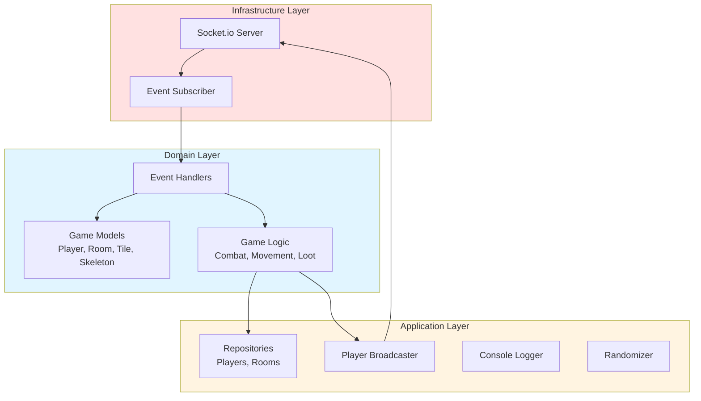
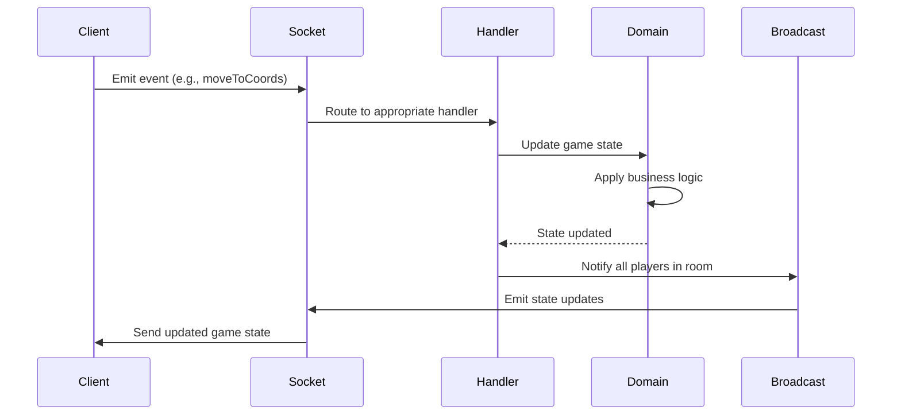

# DungeonJS Server

> Real-time multiplayer game server for turn-based dungeon exploration


## Overview

The server is a real-time multiplayer backend that powers the DungeonJS game. Built with Socket.io for seamless player synchronization, it handles turn-based gameplay, procedural dungeon generation, combat resolution, and inventory management.

**Key Capabilities:**
- Real-time multiplayer room management
- Turn-based gameplay coordination
- Procedural dungeon generation as players explore
- Dice-based combat system
- Event-driven architecture for all game actions
- Dependency injection for testability

## Tech Stack

| Category | Technologies |
|----------|-------------|
| **Core** | Node.js 18+, TypeScript 5.6, Express |
| **Real-time** | Socket.io 4.8 |
| **Architecture** | Hexagonal Architecture, TSyringe (DI) |
| **Build & Dev** | Vite 6.0, Vitest 3.1, Nodemon 3.1, tsx 4.19 |

## Architecture

The server follows **Hexagonal Architecture** (also known as Ports and Adapters), which isolates business logic from infrastructure concerns. This makes the codebase highly testable and maintainable.



**Layer Responsibilities:**
- **Domain**: Pure game logic and business rules (no external dependencies)
- **Application**: Concrete implementations of repositories and services
- **Infrastructure**: Socket.io integration and external communication

**Dependency Injection** with TSyringe enables:
- Easy unit testing with mocked dependencies
- Configurable game parameters
- Clean separation of concerns

## Game Features

- **Multiplayer Rooms** - Create and join game sessions with other players
- **Turn-Based Gameplay** - Players take turns moving and performing actions
- **Procedural Generation** - Rooms and corridors dynamically generated during exploration
- **Dice-Based Combat** - Roll dice plus weapon bonuses to defeat enemies
- **Enemy Types** - Multiple skeleton types including a final boss (Golem)
- **Inventory System** - Collect weapons, keys, and treasures
- **Win Condition** - Defeat the boss and collect the most treasures

## Project Structure

```
apps/server/src/
├── Domain/                  # Business logic layer
│   ├── Model/              # Game entities (Player, Room, Tile, Skeleton, Loot)
│   ├── EventHandler/       # Handles incoming Socket.io events
│   ├── Event/              # Event definitions (client ↔ server)
│   ├── Geometry/           # Coordinate and vector utilities
│   ├── Tile/               # Tile generation (Rooms, Corridors)
│   ├── Skeleton/           # Enemy creation
│   ├── Loot/               # Loot generation
│   ├── Repository/         # Repository interfaces
│   └── Notification/       # Broadcaster interfaces
├── Application/            # Implementation layer
│   ├── Repository/         # Repository implementations
│   ├── Notification/       # Broadcaster and turn allocator
│   ├── Logger/             # Logging implementation
│   └── RNG/                # Random number generation
├── Infra/                  # Infrastructure layer
│   ├── Websocket/          # Socket.io wrappers
│   └── EventSubscriber.ts  # Event routing to handlers
├── container.ts            # Dependency injection setup
└── main.ts                 # Application entry point
```

## Getting Started

### Prerequisites

- Node.js 18+
- pnpm (recommended) or npm

### Installation

```bash
# Install dependencies
pnpm install

# Copy environment file (if needed)
cp .env.dist .env
```

### Development

```bash
# Start development server (runs on port 8080)
pnpm run dev

# Run tests
pnpm run test

# Build for production
pnpm run build
```

For Docker-based development, see the main [README](../../README.md#getting-started).

## How It Works

The server uses an **event-driven architecture** where all game actions flow through Socket.io events:



**Event Flow:**
1. Client emits an event (e.g., player movement, attack)
2. EventSubscriber routes the event to the appropriate handler
3. Handler validates and updates domain models
4. Game logic executes (combat resolution, tile generation, etc.)
5. PlayerBroadcaster notifies all players in the room
6. Updated game state sent to all connected clients

## Testing

The hexagonal architecture makes testing straightforward:

```bash
# Run all tests
pnpm run test

# Run tests in watch mode
pnpm run test:watch
```

Tests use Vitest and can easily mock:
- Socket.io connections
- Repositories
- Random number generation
- Player notifications

## Reference

For more information:
- [Main Project README](../../README.md) - Installation and overview
- [Client README](../client/README.md) - Frontend architecture and 3D rendering
- [CLAUDE.md](../../CLAUDE.md) - Development commands and patterns
